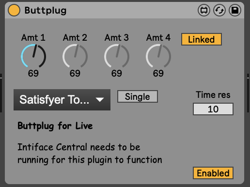

# Buttplug for Live

Uses [buttplug.io](http://buttplug.io/) and Node for Max to control sex toys (currently
only vibrators) from right inside Ableton Live. Is there a good reason to do
that? Probably not, but someone else made a project to
[connect sex toys to Minecraft](https://minegasm.therainbowville.com/) and I
like to think that this is at least more legitimately useful than that. Since
it just exposes knobs to control vibration level and just passes all audio
data straight through, it's intended to be used with other M4L devices such
as LFOs and envelopes that can control the vibration level.

You can download the project [here](gh-content/Buttplug.amxd). For some reason
it seems to crash Ableton when used on M1 macOS unless you set Ableton to open
with Rosetta, so if it doesn't work then try that.
